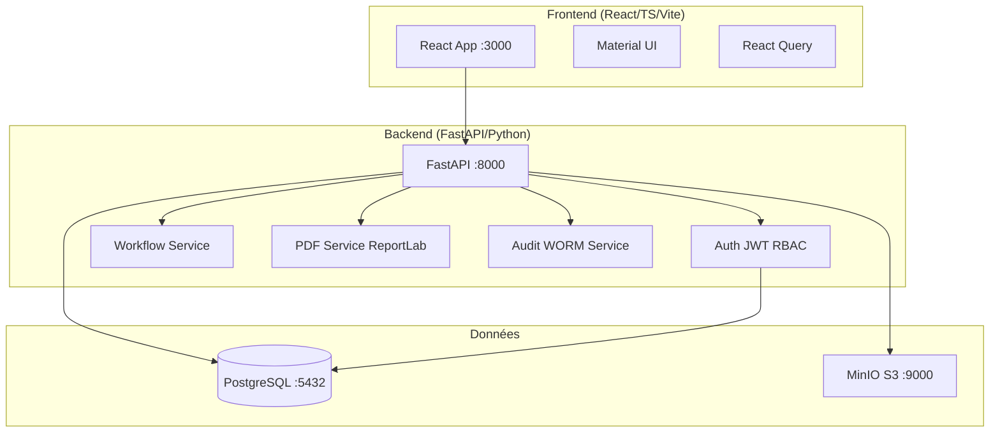
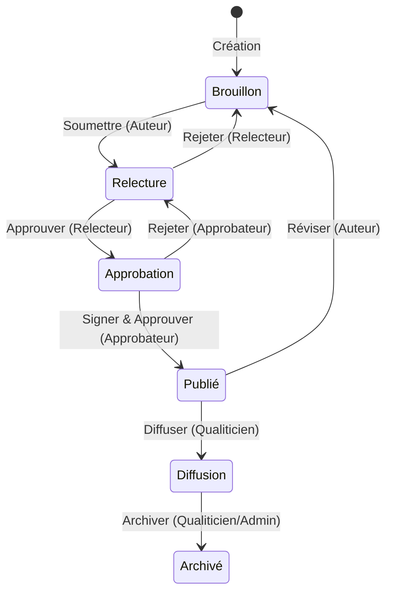
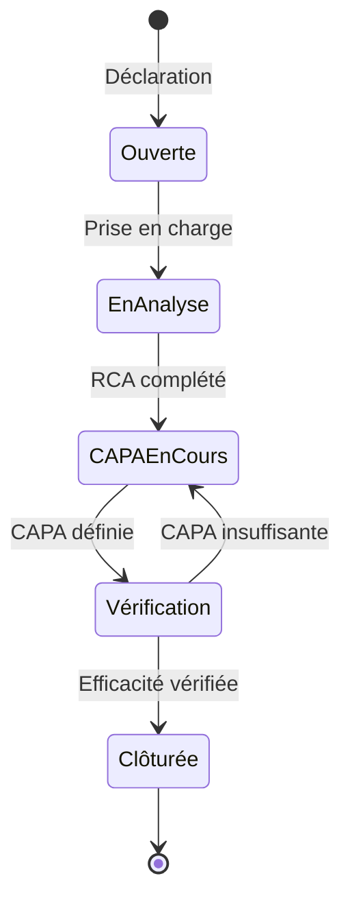
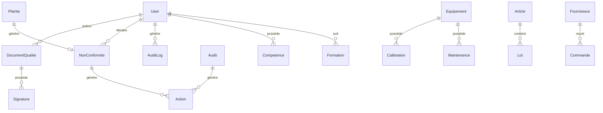

# KaliLab — Architecture technique

## Diagramme d'architecture système

## Diagramme workflow documentaire

## Diagramme workflow Non-Conformité

## Diagramme entités principales (simplifié)

## Couches applicatives

### Backend

| Couche | Rôle | Technologies |
|--------|------|-------------|
| Routeurs | Endpoints REST, validation des entrées | FastAPI, Pydantic |
| Services | Logique métier, orchestration | Python pur |
| Modèles | ORM, schémas de données | SQLModel, PostgreSQL |
| Auth | JWT, RBAC, signatures | python-jose, passlib |
| Stockage | Documents, certificats, PDF | boto3, MinIO |
| PDF | Génération rapports | ReportLab |

### Frontend

| Couche | Rôle | Technologies |
|--------|------|-------------|
| Pages | Vues complètes par module | React 18, TypeScript |
| Composants | Composants réutilisables | Material UI v5 |
| API | Appels HTTP, cache | Axios, React Query |
| Contextes | État global (auth, thème) | React Context |
| i18n | Internationalisation FR/EN | react-i18next |
| Types | Contrats TypeScript | TypeScript 5 |

## Modèles de données (24 modèles SQLModel)

### Gestion des utilisateurs
- `User` : identité, rôle, mot de passe hashé, statut actif

### Gestion documentaire
- `DocumentQualite` : titre, type, statut, version, contenu, fichier S3
- `Signature` : utilisateur, horodatage, hash SHA256, commentaire
- `DocumentVersion` : historique des versions

### Qualité
- `Risque` : description, probabilité (1-5), impact (1-5), criticité calculée, actions
- `NonConformite` : type, source, description, statut, analyse causes, CAPA
- `Action` : description, responsable, délai, statut, vérification
- `Audit` : type, périmètre, planification, constats, écarts
- `Constat` : description, criticité, écart, action corrective
- `KPI` : nom, unité, cible, fréquence, mesures

### Matériel
- `Equipement` : référence, fabricant, statut, prochaine calibration
- `Calibration` : date, résultats, certificat S3, statut
- `Maintenance` : type, date, intervenant, rapport

### Ressources humaines
- `Competence` : utilisateur, domaine, niveau, validité
- `Formation` : titre, date, organisme, évaluation, attestation S3
- `PlanningAbsence` : utilisateur, type, dates, statut

### Stock & commandes
- `Article` : référence, code GS1, type, fournisseur principal
- `Lot` : numéro, article, DLU, statut quarantaine/essai
- `Fournisseur` : raison sociale, contacts, évaluation
- `Commande` : numéro, fournisseur, lignes, statut, réception

### Plaintes
- `Plainte` : source, description, gravité, analyse, actions, clôture

### Piste d'audit
- `AuditLog` : utilisateur, action, entité, données avant/après, hash chaîné, timestamp

## Piste d'audit WORM

Le journal d'audit est de type WORM (Write Once Read Many) :
- Chaque entrée contient un hash SHA256 chaîné au hash précédent
- Aucune modification ni suppression n'est possible via l'API
- Aucun rôle ne dispose des permissions DELETE sur `audit_logs`
- Contrainte CHECK en base de données pour l'horodatage croissant
- Export CSV et JSON disponibles pour les rôles Admin et Qualiticien

## Authentification et autorisation

### JWT
- Algorithme : HS256 (configurable RS256 en production)
- Durée de vie : 480 minutes (8 heures)
- Payload : `sub` (user_id), `role`, `exp`, `iat`

### RBAC — 5 rôles
| Rôle | Code | Description |
|------|------|-------------|
| Administrateur | `admin` | Accès complet |
| Qualiticien | `qualiticien` | Gestion qualité, documents, NC, audits |
| Responsable Technique | `resp_tech` | Matériel, méthodes, stock |
| Biologiste | `biologiste` | Lecture étendue, saisie plaintes |
| Technicien | `technicien` | Lecture limitée, déclaration NC/plaintes |

### Signatures électroniques
- Hash SHA256 du contenu du document + user_id + timestamp
- Stocké en base de données avec le document
- Non modifiable après création

## Infrastructure Docker

| Service | Image | Port | Usage |
|---------|-------|------|-------|
| postgres | postgres:16-alpine | 5432 | Base de données principale |
| minio | minio/minio:latest | 9000, 9001 | Stockage objets S3 |
| backend | custom (Python 3.11) | 8000 | API FastAPI |
| frontend | custom (Nginx + React) | 3000 | Application web |

## Conventions de développement

### Backend
- Endpoints : `/{module}/{id}` (RESTful)
- Réponses : JSON avec modèles Pydantic
- Erreurs : codes HTTP standards + message en français
- Async : toutes les opérations DB sont async (asyncpg)
- Tests : pytest-asyncio avec base de données de test isolée

### Frontend
- Composants : PascalCase, un fichier par composant
- Hooks : préfixe `use`, un fichier par hook
- API : un module par domaine métier dans `src/api/`
- Types : définis dans `src/types/`, importés explicitement
- Styles : Material UI sx prop, pas de CSS inline
